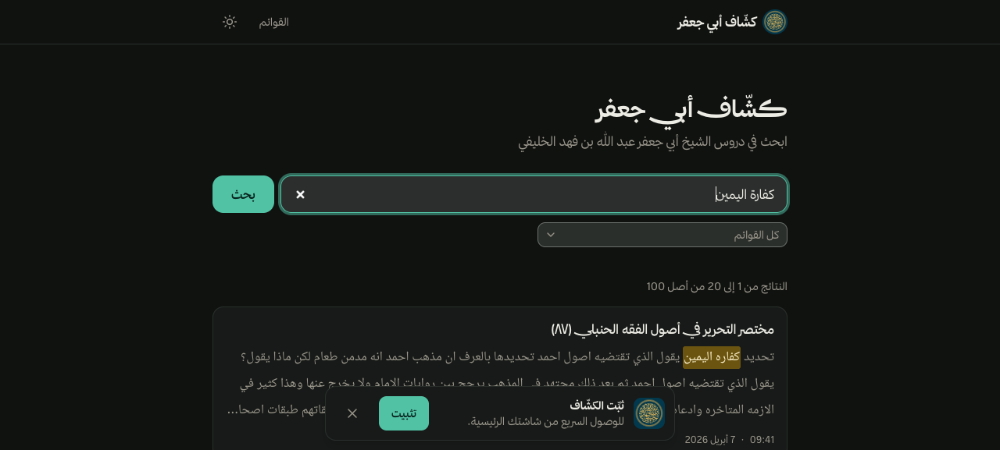
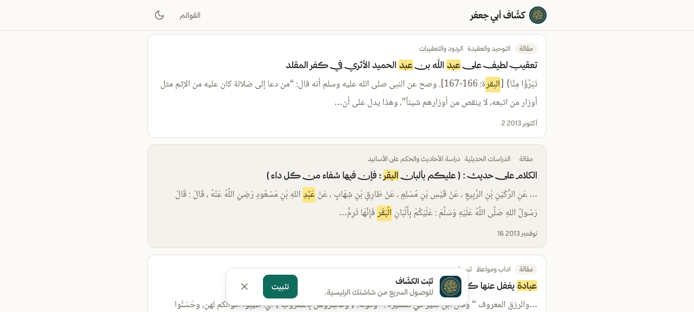
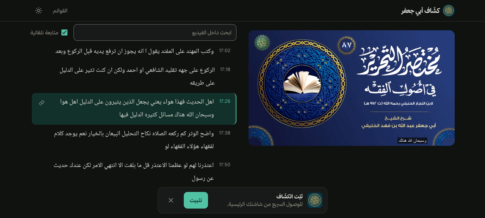
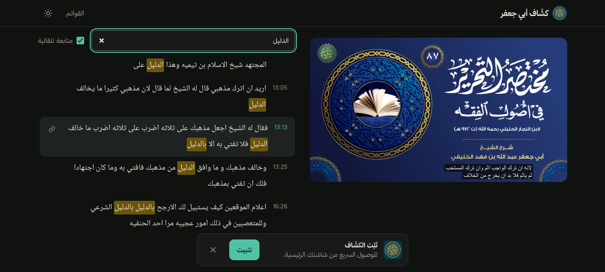
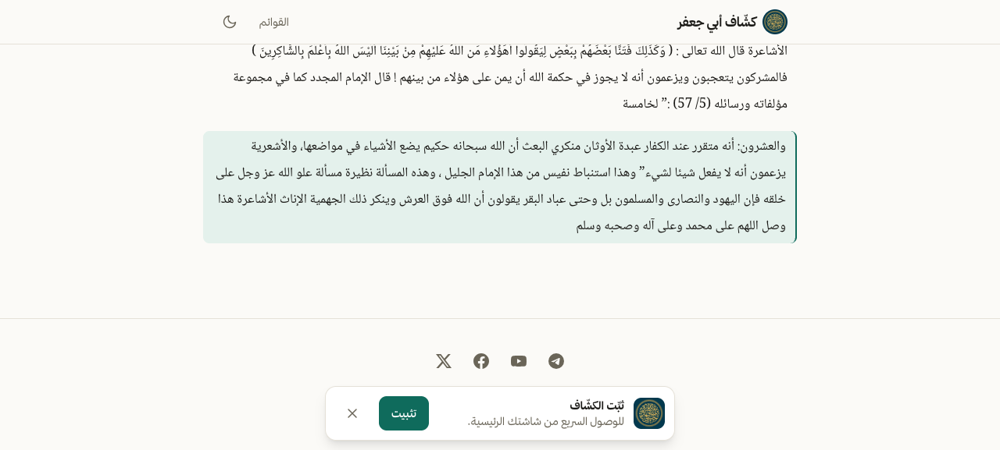
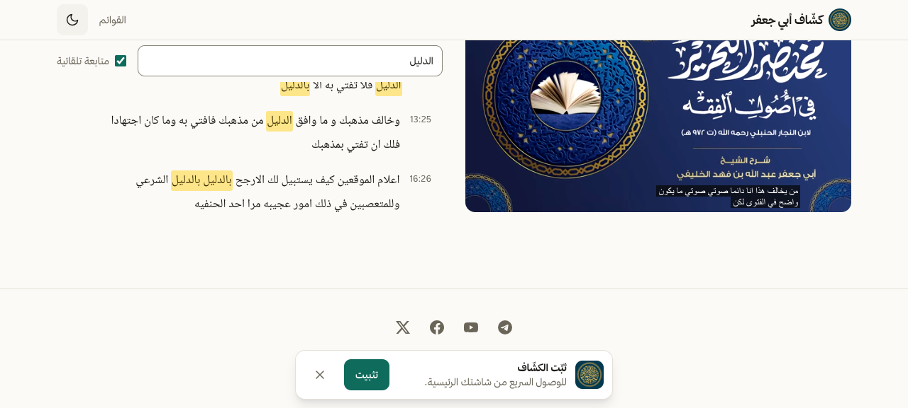
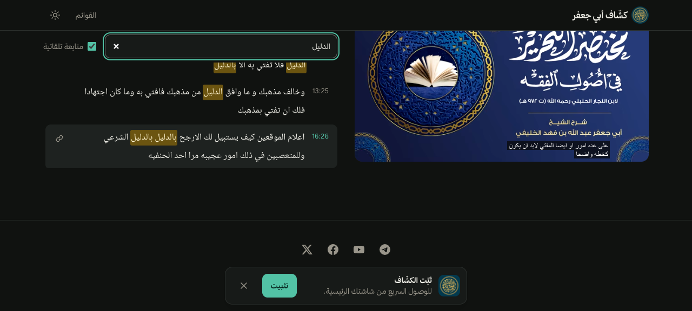
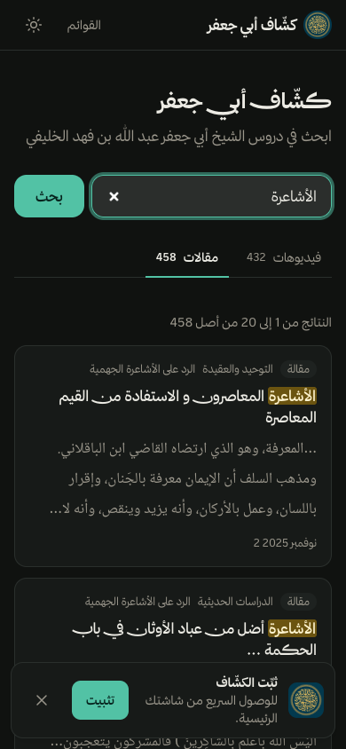

<div align="center">


# Kashaf Abu Jaafar — كشّاف أبي جعفر

**Full-text search over the lectures and articles of Sheikh أبو جعفر عبد الله بن فهد الخليفي**

Arabic-only, RTL, no login, no database.

[](https://kashaf-alkulify.assoli.site)
[](https://astro.build)
[](https://www.meilisearch.com)
[](LICENSE)

[العربية](README.md) · [Product spec](docs/PRD.md)

</div>

---

## What it is

Lectures from [@Alkulify1](https://www.youtube.com/@Alkulify1) are transcribed offline, the sheikh's
articles are scraped from his blog, and both are indexed into Meilisearch. Type a phrase, get the
moments it was said, click once to open the video at that second.

- **Two tabs, videos and articles**, each with its own hit count; playlist filter on the videos tab.
- **A hit is a ~30 s transcript cue** that opens the player at its timestamp, or an article paragraph
  that opens the article scrolled to it.
- **Interactive transcript** beside the player: auto-follow of the current line, in-lecture search,
  copy a link to any line.
- **No search backend**: the browser queries Meilisearch directly with a search-only key, and every
  page is statically built.
- Light/dark, mobile-first, keyboard and screen-reader support.

## Screenshots

| Home and search | Articles tab |
|---|---|
|  |  |

| Lecture page: player + transcript | In-lecture search |
|---|---|
|  |  |

| Article page | Light / dark |
|---|---|
|  | <br> |

<details>
<summary>On mobile</summary>

| Lecture | Articles |
|---|---|
|  |  |

</details>

## How it works

```
YouTube ──▶ tafrigh (YouTube captions, wit.ai fallback) ──┬─▶ <id>.chunks.ndjson ──▶ Meilisearch (cues)
                                                          └─▶ <id>.transcript.json ─▶ data/ ─┐
                                                                                              ├─▶ Astro (static)
Blogger feed + archive.org ──▶ scripts/articles.ts + wayback.ts ──▶ data/articles/ ───────────┘
                                                                 └──▶ Meilisearch (articles)
```

Transcription and indexing run on the maintainer's machine, never on a server. The repo carries
`data/` (the build snapshot); Meilisearch carries the search documents.

## The corpus (current `data/` snapshot)

| | |
|---|---|
| Lectures transcribed | 1,134 (≈828 h) — out of ~4,000 on the channel, ongoing |
| Cues indexed | 46,613 |
| Articles | 3,333 (≈37k paragraphs) |
| Playlists | 14 |

## Run it locally

```bash
pnpm install
cp .env.example .env                 # RAW_DIR = tafrigh's output dir

brew install meilisearch             # production uses compose.yml on a VPS
pnpm meili &                         # db in git-ignored ./data/

pnpm ingest                          # data/ snapshot + Meilisearch index; prints the search-only key
                                     # paste it into PUBLIC_MEILI_SEARCH_KEY in .env
pnpm dev                             # http://localhost:4321
```

Without tafrigh output, `pnpm dev` alone still browses the site off the committed `data/`; only
search needs Meilisearch.

### Scripts

| script | what it does |
|---|---|
| `pnpm data` | `RAW_DIR/*.transcript.json` → `data/{videos,playlists}.json` + `data/segments/<id>.json` |
| `pnpm articles` | Blogger Atom feed → `data/articles/<id>.json` |
| `pnpm index` | cues + articles → Meilisearch, and creates/reuses the browser's search-only key (`pnpm index cues\|articles` does one side) |
| `pnpm ingest` | all three, in order |
| `pnpm check` | self-checks for the text plumbing (highlighting, folding, cleaning, formatting) |
| `pnpm build` / `preview` | static build of every page / serve `dist/` |

All steps are safe to re-run. `pnpm data` rebuilds `data/` from scratch, so a lecture removed from
`RAW_DIR` also disappears from the next build. `pnpm index` overwrites cues by `id` and only deletes
cues whose text cleaned to empty — to drop a lecture from the index, delete by filter
(`videoId = "<id>"`).

## Arabic search

Both parameters are required or the results are wrong:

```json
{ "q": "بر الوالدين", "locales": ["ara"], "matchingStrategy": "all" }
```

- `locales` makes charabia fold hamza and ta-marbuta at query time.
- `matchingStrategy: "all"` stops the split-off definite article `ال` from matching the whole corpus
  (the default `last` returns ~99% of documents for any query starting with `ال`).
- `minWordSizeForTypos.oneTypo: 4` in `meilisearch-settings.json` keeps short Arabic roots
  typo-tolerant (`الطلاك` → `الطلاق`).

The browser only ever holds a search-only key (action `search`, indexes `cues` and `articles`); the
admin key stays in `.env`.

## Articles

`alkulify.com` (WordPress, the sheikh's own site) has been answering Cloudflare 522 since ~2026-07,
so the corpus is assembled from the two sources that do answer:

```bash
pnpm articles                        # Blogger mirror: 2,346 posts, but it stops at 2019-06
npx tsx scripts/wayback.ts           # archive.org snapshots of alkulify.com, through 2026
```

`wayback.ts` reads the CDX index, pulls the newest usable capture of every archived post (falling
back through older captures when one is a Cloudflare interstitial), and finishes by deleting the
Blogger copy of every post the site itself covers. It logs finished URLs to `data/wayback-done.txt`,
so an interrupted run resumes where it stopped. Result: 3,333 articles (3,232 `wp` + 101
Blogger-only), ~37k paragraph chunks. Four posts are unrecoverable — their only capture is an
interstitial — and are listed in `data/wayback-failed.txt`.

The PDF collection of the blog is *not* a usable source: `pdftotext` reverses digit runs (hadith
no. 2135 → 5312) and injects plain spaces inside words (`معاو ية`), which no cleanup short of
re-merging glyph coordinates undoes.

## Transcription

Lives in the [tafrigh](https://github.com/ieasybooks/tafrigh) checkout, unmodified (flags only):

```bash
cd ~/Downloads/tafrigh && .venv312/bin/tafrigh "<playlist or channel URL>" \
  --skip_if_output_exist --use_youtube_transcript -o output -f none \
  -w "$WIT_TOKEN" "$WIT_TOKEN_2" "$WIT_TOKEN_3" \
  --min_words_per_segment 0 --max_cutting_duration 15
```

It takes the channel's own Arabic caption track when there is one (~2000× real time) and falls back
to wit.ai when there is not (~8× real time per token, linear in the number of tokens). Use
`.venv312`, not `.venv`: the wit path is broken on Python 3.14 (`pydub` → removed `audioop`).

Each lecture yields `<id>.chunks.ndjson` (index-ready search cues, already overlapping and capped at
30 s) and `<id>.transcript.json` (fine-grained segments + video metadata, which is what the site's
transcript panel and `data/` are built from).

## Deployment

- **Frontend**: Vercel, auto-deploying on every push to `main`. The build is static, so `PUBLIC_*`
  vars are baked at build time — changing one needs a redeploy, not just a settings save.
- **Search**: self-hosted Meilisearch behind Caddy (automatic TLS) on a small VPS — `compose.yml` is
  what runs there.
- **Indexing**: from the maintainer's machine straight at the remote host; `scripts/index.ts` is
  idempotent.

> `pnpm deploy` is a leftover from the Cloudflare Pages setup that predated Vercel; it is unused.

## Layout

```
scripts/      data pipeline: build-data · articles · wayback · index · selfcheck
src/pages/    home · /v/[id] lecture · /a/[id] article · /p playlists
src/islands/  the two React islands: Search and Player (player + transcript)
src/lib/      text cleaning/normalizing/highlighting, Meilisearch client, build data, SEO
data/         build snapshot: videos · playlists · segments/ · articles/
docs/PRD.md   product spec
```

## Contributing

Issues and PRs are welcome — the most useful reports are a bad transcript line or a strange search
result with the page URL. Run `pnpm check` before pushing.

## License and content

The code is [MIT](LICENSE). The sheikh's lectures, articles, and their transcripts belong to their
owners and are not covered by the code license.

## Credits

[tafrigh](https://github.com/ieasybooks/tafrigh) for transcription, [baheth](https://baheth.ieasybooks.com)
for the idea, [Meilisearch](https://www.meilisearch.com) and charabia for Arabic normalization.
